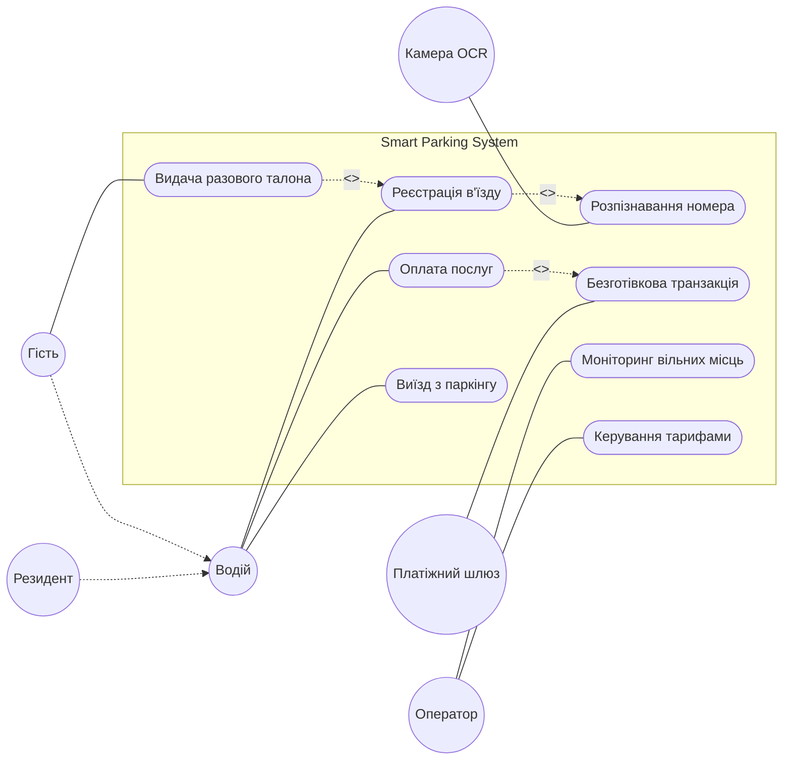
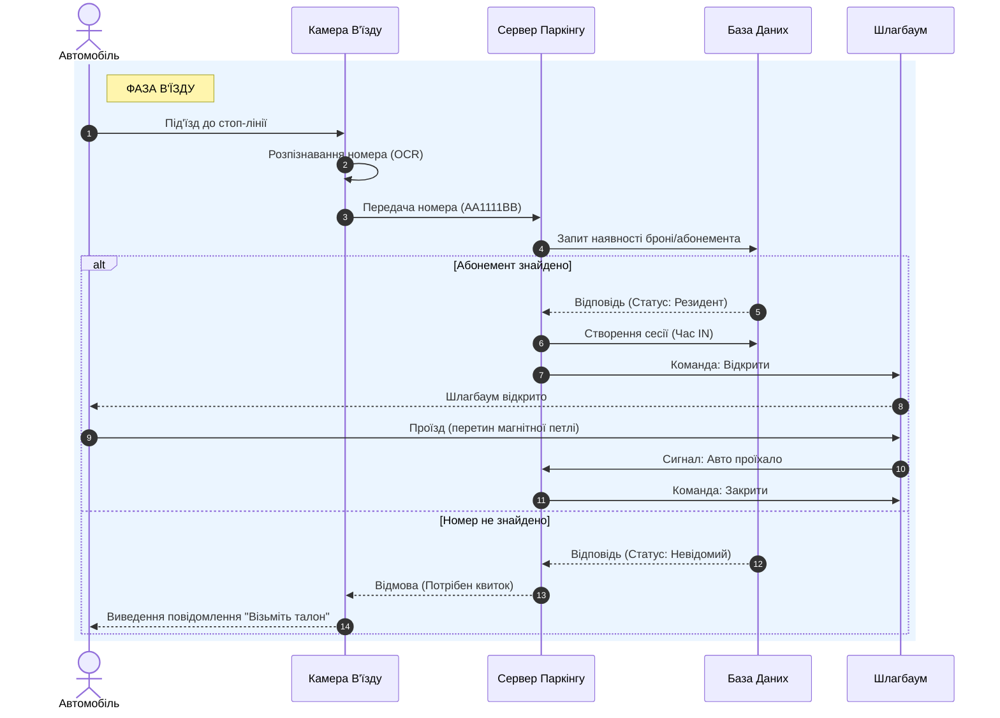
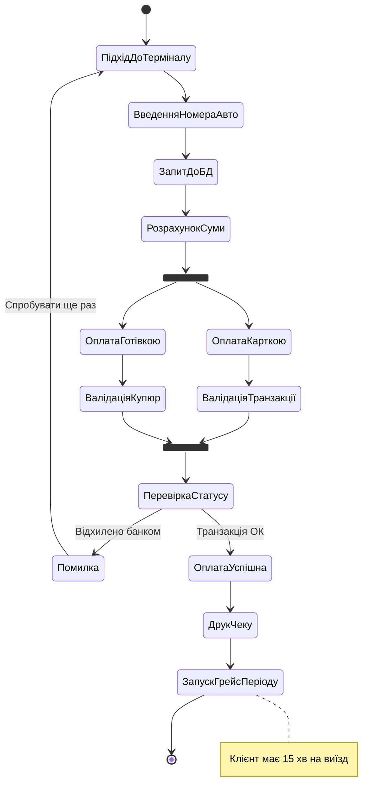

# Практичне заняття: pz-UML
## Проєктування інтелектуальної системи керування паркінгом "SmartPark"

Предметна область: Інформаційна система автоматизації паркувального простору. Система забезпечує безконтактний в'їзд завдяки розпізнаванню автономерів, контроль заповнюваності, гнучку тарифікацію та інтеграцію з зовнішніми платіжними сервісами.
---

### 1. Діаграма варіантів використання (Use Case Diagram)
Мета: Визначення меж системи, основних функціональних можливостей та ролей користувачів (акторів), які з нею взаємодіють.

Аналіз: Діаграма демонструє, що система обслуговує два типи водіїв (резидентів з абонементами та гостей). Виділено ключові зовнішні модулі (камера та банк), які автономно виконують частину роботи, розвантажуючи адміністратора.

---

### 2. Діаграма послідовності (Sequence Diagram)
Сценарій: Процес в'їзду автомобіля на територію, розпізнавання номера та взаємодія з апаратним забезпеченням.

Аналіз: Діаграма чітко показує хронологію викликів. Сервер виступає центральним контролером, який приймає рішення на основі даних з БД і лише потім відправляє команду на відкриття шлагбаума.

---

### 3. Діаграма діяльності (Activity Diagram)
Мета: Візуалізація бізнес-логіки та алгоритму розрахунку клієнта за паркування.

Аналіз: Відображено паралельні процеси вибору методу оплати (`fork`/`join`) та умовне розгалуження на випадок збою транзакції. Логіка завершується стартом "грейс-періоду", що пов'язує цю діаграму з подальшим процесом виїзду.

---

### Висновки
Побудовані діаграми повністю описують архітектуру поведінки розроблюваної системи:
1. Use Case окреслила загальні функціональні вимоги та користувачів.
2. Sequence деталізувала технічну взаємодію між сервером, базою даних та апаратним забезпеченням у часі.
3. Activity дозволила продумати алгоритмічні кроки та обробку помилок у критичному бізнес-процесі (оплата).

Діаграми пов'язані між собою єдиною предметною областю та виконані з використанням підходу Diagrams as Code (Mermaid.js).
